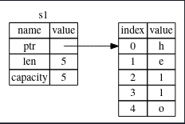
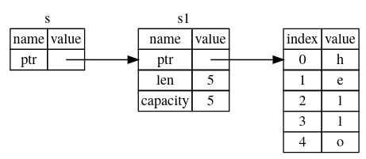

# Ownership in Rust

## Ownership Rules in Rust

1. Each value in Rust is associated with a variable and that variable is called the owner.
2. There will be only one owner at a particular time.
3. When the owner goes out-of-scope, the value is dropped.

## Examples

#### Example 1

```rust
fn main() {
    { // 's' in not valid here because it's not declared yet.
    let s: &str = "Hello"; // 's' is valid from this point.
    } // the scope is now over so 's' is no valid after this point.
}
```
- This example follows the third rule of ownership.
- First `x` owns the string literal (`&str`), then after it goes out of scope the ownership is dropped.

#### Example 2

```rust
fn main() {
    let s1: String = String::from("hello");
    let s2: String = s1; // "move" occured here, as it is the default behaviour in Rust when assigning on variable to other.

    println!("{}", s1); // ❌ this will not work, as s1 no longer owns the string.
}
```
- In example 2, first the variable `s1` owns the string with value `"hello"`, so at this step `s1` is the owner.



- In the second statement `s1` is assigned to `s2` and as result the ownership is shifted to `s2`.
- The reason for this behaviour is that the type `String` has no `Copy trait` associated with it, so the ownership is shifted from one variable to other.
- If copying is the required use `s1.clone()`.


#### Example 3

```rust
fn main() {
    let x: i32 = 5;
    let y: i32 = x;
}
```
- Unlike the previous example, the copy is done between `x` and `y` here. The value of `x` is copied to `y`.
- The ownership still remains with `x`, not shifted to `y`.
- The reason behind this behaviour is that Rust provides the `Copy trait` for the simple type like integers, booleans, characters etc.
- So while assigning the value in this example, the ownership remains with `x` and value is copied to `y`.

#### Example 4
```rust
fn main() {
    let s: String = String::from("hello");
    takes_ownership(s);
    println!("{}", s); // ❌ this will not work.
}

fn takes_ownership(some_string: String) {
    println!("{}", some_string);
}
```
- When we passed a variable as a parameter to a function, it is same as if we were assigning it to some other variable.
- So, here passing `s` to `takes_ownership` function will move the ownership of `s` to `some_string` variable.
- Then after the function is completed, or it's scope is over the value is dropped by the third rule, as listed on top.

#### Example 5

```rust
fn main() {
    let x: i32 = 5;
    makes_copy(x);
    println!("{}", x); // ✅ this will work, because the ownership is not moved.
}

fn makes_copy(some_integer: i32) {
    println!("{}", some_integer);
}
```
- Unlike the previous example, here the variable `x` is compied rather than moved because simple types have `Copy trait`, so ownership is not shifted.

#### Example 6

```rust
fn main() {
    let s1 = gives_ownership();
    println!("{}", s1);
}

fn gives_ownership() -> String {
    let some_string: String = String::from("hello");
    some_string
}
```

- Here in the function `gives_ownership`, the ownership is moved towards the `s1` in `main` function.(because of the `gives_ownership` return type i.e. `String`.

#### Example 7

```rust
fn main() {
    let s1: String = gives_ownership();
    let s2: String = String::from("hello");
    let s3: String = takes_ownership(s2);
    println!("s1= {}, s3 = {}", s1, s3);
}

fn gives_ownership() -> String {
    let some_string: String = String::from("hello");
    some_string
}

fn takes_ownership(a_string: String) -> String {
    a_string
}
```
----

## References in Rust

- References don't take the ownership. The value is only borrowed for some time.
- Passing in references as function parameters is known as __borrowing__ (borrow the value but not take its ownership).
- References are immutable by default.


#### Example 1
```rust
fn main() {
    let s1: String = String::from("hello");
    // let s2: String = s1; // this was the previous problem that we faced. (the ownership was moved)
    let s2: String = &s1;

    println!("{}", s1); // ✅ this will work, because the ownership is not moved.
}
```
- In this example, we only give the reference of `s1` to `s2` with the help of reference operator `&`.
- The statement `let s2: String = &s1` says that I want to use the s1 variable's values but don't want it's ownership. I just want to borrow it for some time, the ownership should remain to current owner.

#### Example 2

```rust
fn main() {
    let s1: String = String::from("hello");
    takes_ownership(&s1); // only the reference is given, not ownership.
    println!("{}", s1); // ✅ this will work, because the ownership is not moved.
}

fn takes_ownership(s: &String) { // the parameter is also receiving the reference to the string.
    println!("{}", s);
}
```



- `s` holds the reference of `s1` and `s1` holds the reference of actual string.
- When the function `takes_ownership` finishies execution `s` is dropped with its ownership, but we still have `s1` pointing to our string.

#### Example 3

```rust
fn main() {
    let s1: String = String::from("hello");
    takes_ownership(&s1);
    println!("{}", s1);
}

fn takes_ownership(s: &String) {
    s.push_str("world"); // ❌ this will not work.
    println!("{}", s);
}
```
- As references are immutable by default, so we can't modify the value.
- So, if we did want to __modify a value without taking its ownership__.
- First, we will make `s1` as mutable.
- Next, instead of passing a simple reference, we will pass a mutable reference.
- Finally, we modify our `takes_ownership` function to take in mutable reference.
```rust
fn main() {
    let mut s1: String = String::from("hello");
    takes_ownership(&mut s1);
    println!("{}", s1);
}

fn takes_ownership(s: &mut String) {
    s.push_str("world"); // ✅ this will work
    println!("{}", s);
}
```
- Now, the `takes_ownership` function is able to change the string without taking the ownership.
- __The scope of a reference starts from when it is first introduced and ends when it is used for the last time.__

#### Example 4

```rust
fn main() {
    fn main() {
    let mut s: String = String::from("hello");
    let r1: &String = &s; // the scope of r1 starts from here.
    let r2: &String = &s;

    println!("{}, {}", r1, r2); // the scope of r1 ends here, as it is last used here.
}
```
### Restrictions of mutable references

```rust
fn main() {
    let mut s: String = String::from("hello");
    let r1: &mut String = &mut s;
    let r2: &mut String = &mut s; // ❌ only one mutable reference is allowed for a variable in a scope.
    println!("{}, {}", r1, r2); // ❌ will not work.
}
```
- __We can only have one mutable reference to particular piece of data in a particular scope__.
- This prevents the race conditions (a.k.a data races).
- But we can have as many immutable reference as we like, because the underlying data is not going to change.

```rust
fn main() {
    let s: String = String::from("hello");
    let r1: &String = &s;
    let r2: &String = &s;
    let r3: &String = &s;
    let r4: &String = &s;
}
```
- We can't have a mutable reference if already an immutable reference exists.
- As immutable reference don't expect underlying value to change, so it will be problematic if we have a mutable reference.

```rust
fn main() {
    let mut s: String = String::from("hello");
    let r1: &String = &s;
    let r2: &String = &s;
    let r3: &mut String = &s; // ❌ this will not work.
}
```

- So, when the scope of the immutable reference is no more, we can then declare a mutable reference.

```rust
fn main() {
    let mut s: String = String::from("hello");
    let r1: &String = &s;
    let r2: &String = &s;

    println!("{}, {}", r1, r2); // the scope of r1, r2 ends here. No immutable reference present after this point in the program.
    // now we can declare a mutable reference.
    let r3: &mut String = &mut s;
    println!("{}", r3);
}
```
#### Dangling references
```rust
fn main() {
    let reference_to_nothing: &String = dangle();
}

fn dangle() -> &String() {
    let s: String = String::from("Hello");
    &s
}
```
- The variable `s` is set to string and is returned from function as a reference.
- However, `s` is defined only within the scope of `dangle` function, so when `dangle` will finish executing Rust will drop or de-allocate our string from the heap.
- So, now our reference will be pointing to invalid memory.
- But, Rust prevents this from happening. There will be compile time error stating `this function's return type contains a borrowd value, but there is no value for it to be borrowd from`.
- Solution to this is using lifetime. e.g. `&'static str`.
